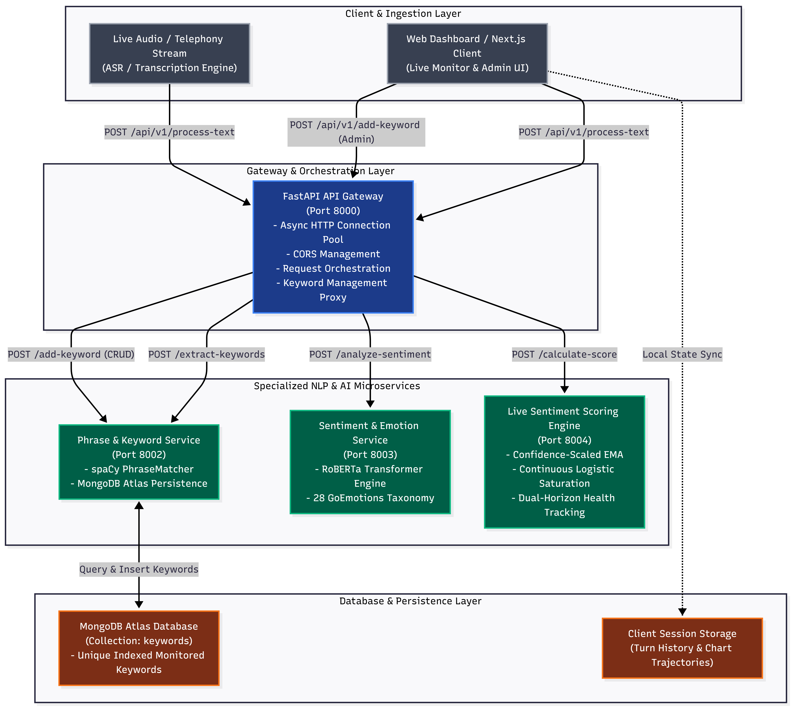
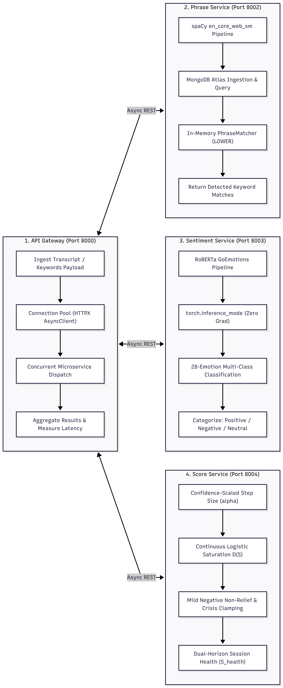
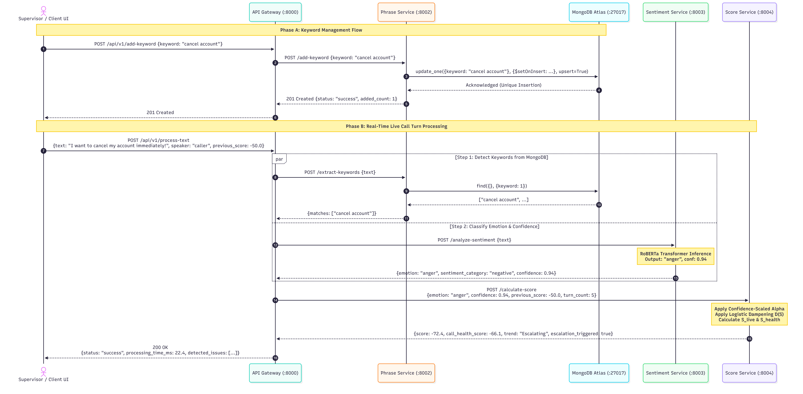
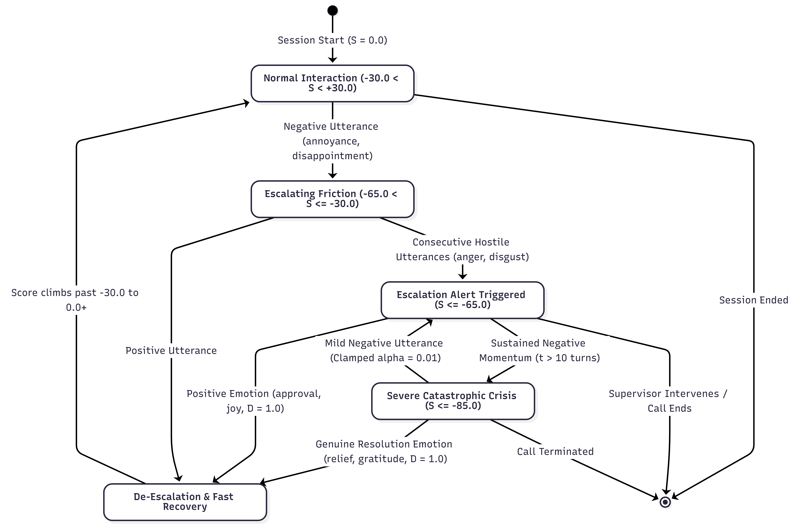
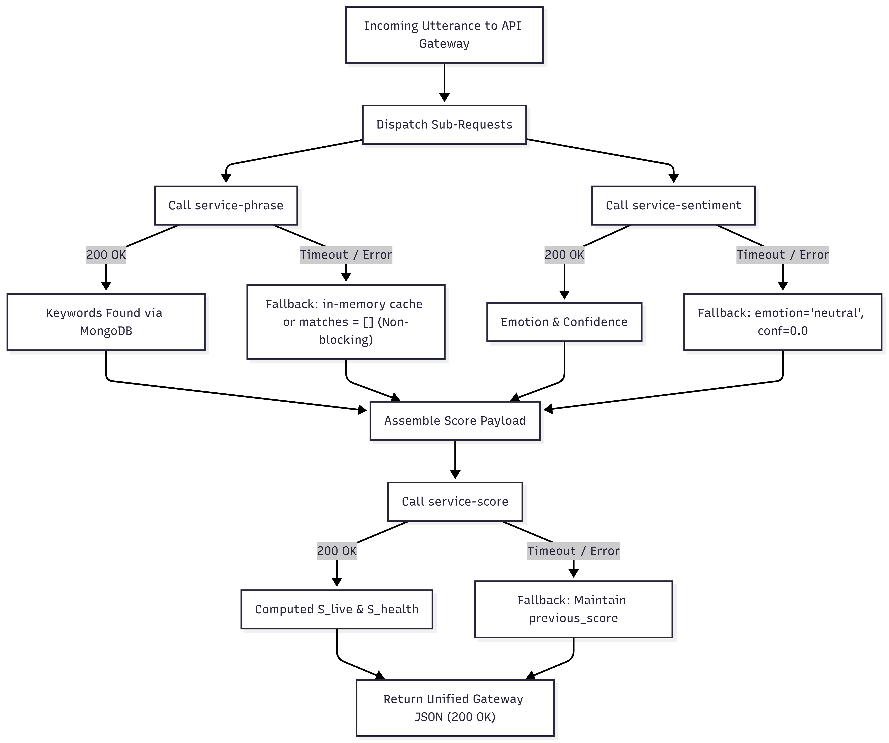
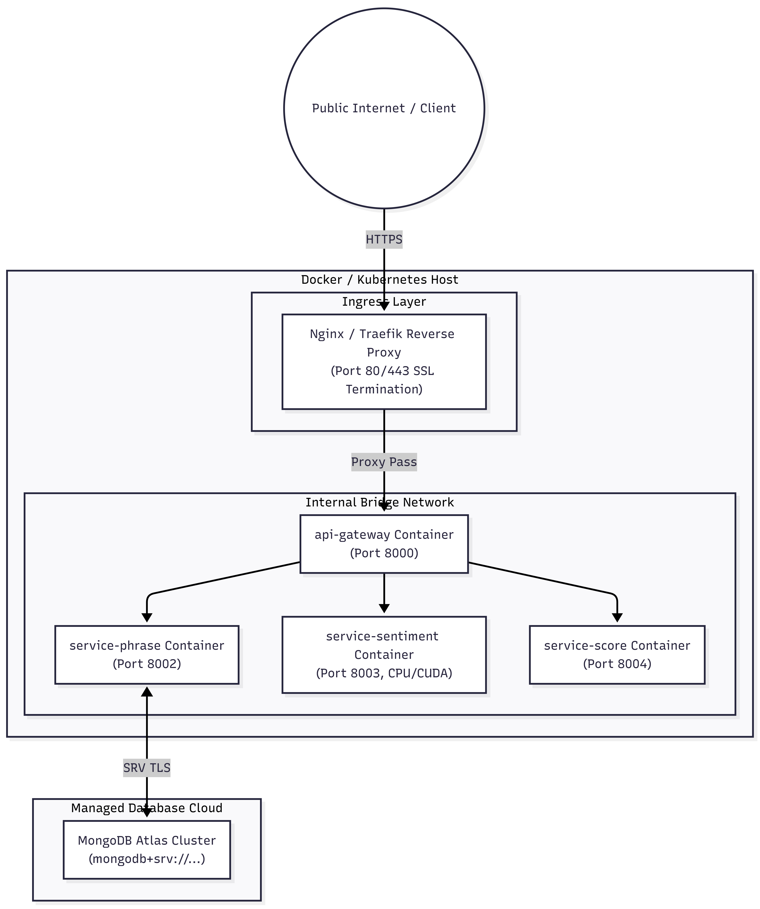

# System Architecture & Technical Design Specification

This document provides a comprehensive architectural and engineering specification of the **Live Call Sentiment Analysis & Real-Time Monitoring System**. It details the decoupled microservices architecture, inter-service communication protocols, data flows, scoring state transitions, package ecosystem, and deployment strategies.

---

## 1. High-Level Architectural Overview

The Live Call Sentiment platform is designed around a **decoupled, asynchronous microservices architecture** optimized for high-throughput, low-latency live conversational intelligence in customer contact centers.

---

## 2. Microservice Topology & Component Responsibilities

### 2.1 API Gateway (`api-gateway/main.py`)
- **Role**: Central ingress proxy, orchestrator, and keyword management routing hub.
- **Port**: `8000` (configurable via `API_GATEWAY_PORT`).
- **Connection Management**: Instantiates a persistent `httpx.AsyncClient` with connection pooling (`max_keepalive_connections=20`, `max_connections=100`, `timeout=30.0s`) on application startup, eliminating TCP handshake overhead for subsequent calls.
- **CORS Support**: Enforces secure cross-origin resource sharing configured via `CORS_ORIGINS` (defaults to `http://localhost:3000`).
- **Keyword Proxy Endpoints**:
  - `POST /api/v1/add-keyword`: Proxies keyword addition to `service-phrase`.
  - `GET /api/v1/admin-keywords`: Proxies keyword fetching to `service-phrase`.
  - `DELETE /api/v1/delete-keyword/{keyword}`: Proxies keyword deletion to `service-phrase`.
- **Resilience**: Independent error containment per microservice call. If `service-phrase` fails, sentiment and scoring continue uninterrupted; if `service-sentiment` fails, graceful neutral defaults are returned.

### 2.2 Phrase Extraction Service (`service-phrase/main.py`)
- **Role**: High-speed keyword identification, sentence phrase matching, and MongoDB keyword database operations.
- **Port**: `8002` (configurable via `PHRASE_SERVICE_PORT`).
- **Engine**: spaCy (`en_core_web_sm`) using `PhraseMatcher(nlp.vocab, attr="LOWER")`.
- **Database Storage (MongoDB Atlas)**:
  - Connects to MongoDB cluster via `MONGODB_URI`.
  - Database: `MONGODB_DB_NAME` (default: `live_call_sentiment`), Collection: `MONGODB_COLLECTION_NAME` (default: `keywords`).
  - Maintains a unique index on the `keyword` field to prevent duplicate phrase records.
  - Automatically loads stored keywords into `PhraseMatcher` for real-time text analysis.
  - Includes graceful in-memory fallback if the database connection is initializing or offline.

### 2.3 Sentiment & Emotion Classification Service (`service-sentiment/main.py`)
- **Role**: Transformer-based deep learning emotion classification.
- **Port**: `8003` (configurable via `SENTIMENT_SERVICE_PORT`).
- **Model**: `SamLowe/roberta-base-go_emotions` (fine-tuned RoBERTa on Reddit GoEmotions dataset spanning 28 fine-grained emotions).
- **Execution Mode**: PyTorch `torch.inference_mode()` with token truncation (`max_length=128`) and batching support (`batch_size=32`), minimizing VRAM/RAM overhead and eliminating computational graph construction.
- **Categorization**: Maps 28 emotions to tri-state sentiment polarity (`positive`, `negative`, `neutral`) using a $0.20$ minimum confidence threshold.

### 2.4 Live Sentiment Scoring Engine (`service-score/main.py`)
- **Role**: Standardized Dual-Horizon stateful mathematical scoring engine.
- **Port**: `8004` (configurable via `SCORE_SERVICE_PORT`).
- **Mathematical Foundations**:
  - **Confidence-Scaled Step Size ($\alpha_{\text{effective}}$)**: Prevents low-confidence noise from causing score reversal paradoxes.
  - **Continuous Logistic Saturation ($D(S)$)**: Smooth non-linear resistance as scores traverse towards $\pm 100.0$.
  - **Mild Negative Non-Relief Rule**: Prevents milder negative emotions during severe crisis from triggering false recovery.
  - **Crisis Neutral Clamping**: Preserves crisis context during informational neutral utterances.
  - **Dual-Horizon Call Health Aggregator ($S_{\text{health}}$)**: Weighted fusion of cumulative session average ($70\%$) and instantaneous live score ($30\%$).

---

## 3. End-to-End Request & Data Flow

The following sequence diagram traces the complete lifecycle of both a caller conversational turn and an administrative keyword configuration update:

---

## 4. Scoring Engine State Machine & Trajectory Lifecycle

---

## 5. Package Ecosystem & Technology Stack

Each microservice leverages a targeted, lightweight set of packages selected for stability, asynchronous performance, and minimal memory footprint:

| Component | Package | Version Constraint | Architectural Purpose & Rationale |
| :--- | :--- | :--- | :--- |
| **API Gateway** | `fastapi` | `>=0.95.0` | High-performance asynchronous REST API framework with native OpenAPI documentation and Pydantic validation. |
| | `uvicorn` | `>=0.21.0` | Lightning-fast ASGI web server implementation based on `uvloop` and `httptools`. |
| | `httpx` | `>=0.24.0` | Next-generation async HTTP client supporting HTTP/1.1 and HTTP/2 connection pooling. |
| | `pydantic` | `>=1.10.0` | Data parsing, type enforcement, and payload validation. |
| | `python-dotenv` | `>=1.0.0` | Environment variable parsing and `.env` file management across runtime contexts. |
| **Phrase Service** | `spacy` | `>=3.5.0` | Industrial-strength NLP library providing exact, efficient multi-token `PhraseMatcher`. |
| | `pymongo` | `>=4.6.0` | Official MongoDB Python driver for performant CRUD operations, connection pooling, and Atlas support. |
| | `dnspython` | `>=2.4.0` | DNS SRV protocol resolution required for MongoDB Atlas connection strings (`mongodb+srv://`). |
| | `pydantic` | `>=1.10.0` | Request and response schema validation. |
| | `python-dotenv` | `>=1.0.0` | Dynamic configuration of MongoDB URI, database, and collection names. |
| **Sentiment Service**| `torch` | `>=2.0.0` | Deep learning backend providing optimized tensor math and GPU/CPU inference kernels. |
| | `transformers` | `>=4.30.0` | Hugging Face pipeline abstraction for loading pre-trained RoBERTa architectures. |
| | `pydantic` | `>=1.10.0` | Batch payload structuring and response serialization. |
| | `python-dotenv` | `>=1.0.0` | Configurable model repository identifier (`SENTIMENT_MODEL_NAME`). |
| **Score Service** | `fastapi` | `>=0.95.0` | High-speed scoring endpoint serving sub-millisecond mathematical calculations. |
| | `pydantic` | `>=1.10.0` | Mathematical request and response contract enforcement. |
| | `python-dotenv` | `>=1.0.0` | Dynamic configuration of alert thresholds. |

---

## 6. Fault Tolerance, Resilience & Fallback Matrix

---

## 7. Production Deployment & Containerization Architecture

### 7.1 Container Mesh Topology

### 7.2 Scaling Recommendations
1. **API Gateway**: Stateless and I/O bound. Scale horizontally with multiple workers (`uvicorn main:app --workers 4`).
2. **Phrase Service**: CPU bound during startup; in-memory lookup during runtime. MongoDB connection pooling handles high concurrent read/write queries.
3. **Sentiment Service**: Compute/RAM bound. When running on CPU, allocate $\ge 2\text{GB}$ RAM per instance; for high-concurrency environments ($>100\text{ req/sec}$), deploy on an NVIDIA T4/A10 GPU with TensorRT or ONNX Runtime acceleration.
4. **Score Service**: Pure mathematical operations ($\approx 0.5\text{ms}$ latency). A single instance easily handles $>2,000\text{ req/sec}$.
