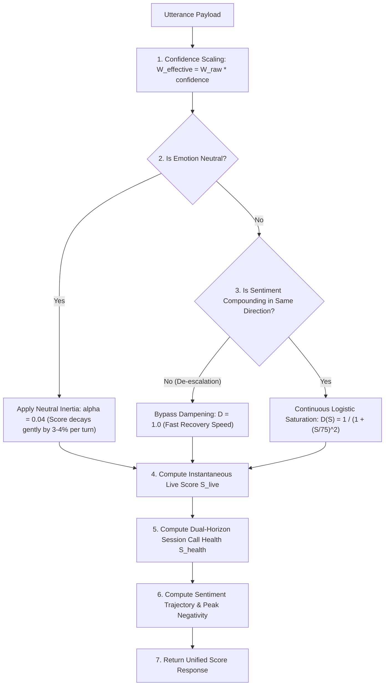

# Standardized Live Sentiment Engine: Technical Upgrade Guide (`english_explanation.md`)

This document provides a comprehensive, developer-focused guide explaining **how the codebase was updated**, **how the new scoring mechanisms work**, **why this architecture is superior to basic EMA**, and a **side-by-side comparison** of the old versus new system.

---

## 1. How the Codebase Was Updated (Step-by-Step Implementation)

The update spans four primary components of the repository:

### 1.1 Microservice `service-score` ([`service-score/main.py`])

- **Schema Expansion**:
  - Expanded `ScoreRequest` to accept `confidence`, `turn_count`, `session_avg_score`, `peak_negativity`, `speaker`, and `recent_scores`.
  - Expanded `ScoreResponse` to return `effective_emotion_weight`, `score` ($S_{\text{live}}$), `call_health_score` ($S_{\text{health}}$), `sentiment_trend`, `peak_negativity`, `turn_count`, and `session_avg_score`.
- **Core Math Pipeline**:
  - `w_effective = raw_weight * confidence` (Confidence Weighting).
  - Implemented `NEUTRAL_ALPHA = 0.04` (Neutral Inertia Attenuation).
  - Implemented `dampening_factor = 1.0 / (1.0 + (abs_score / 75.0) ** 2)` (Continuous Logistic Saturation).
  - Added Fast Recovery logic when sentiment changes direction ($S_{\text{current}} < 0 \land W_{\text{effective}} > 0$).
  - Added session call health aggregator: $S_{\text{health}} = 0.70 \times S_{\text{session\_avg}} + 0.30 \times S_{\text{live}}$.
  - Added trend direction calculator over recent 5 turns (`"Strong Recovery"`, `"Escalating"`, `"Stable"`).

### 1.2 API Gateway ([`api-gateway/main.py`])

- Updated `MessagePayload` Pydantic model to accept long-call session fields (`turn_count`, `session_avg_score`, `peak_negativity`, `recent_scores`).
- Forwarded `confidence`, `speaker`, and session parameters to `SCORE_SERVICE_URL`.
- Exposed complete dual-horizon sentiment details in the gateway `/api/v1/process-message` response object.

### 1.3 Microservice Specification ([`score.md`])

- Rewrote the microservice specification to document the new math formulas, request/response JSON contracts, confidence scaling, neutral inertia, and dual-horizon session health metrics.

### 1.4 Frontend Dashboard ([`frontend/src/app/live/page.tsx`])

- Updated `ScoreDetails` TypeScript interface.
- Updated `handleSendTextMessage` to pass `turn_count`, `session_avg_score`, `peak_negativity`, and `recent_scores`.
- Updated the **Live Sentiment Card** to render:
  - **Overall Call Health Score** (Green/Red indicator).
  - **Peak Negativity** (Historical lowest point reached).
  - **Sentiment Trajectory** (Dynamic trend badge).

---

## 2. How the New Features Work (Technical Deep-Dive)

### 2.1 Confidence-Weighted Emotion Signal ($W_{\text{effective}}$)

$$W_{\text{effective}} = W_{\text{raw}} \times \text{confidence}$$

- **Why it matters**: A classifier prediction with $25\%$ confidence is noisy. Multiplying by confidence scales down its weight to $-25.0$ instead of treating it as $-100.0$.

### 2.2 Neutral Inertia Attenuation ($\alpha_{\text{neutral}} = 0.04$)

$$\alpha_{\text{effective}} = \begin{cases} 0.04, & \text{if emotion is "neutral"} \\ \alpha_{\text{base}} \times D(S), & \text{otherwise} \end{cases}$$

- **Why it matters**: In call centers, $60-70\%$ of sentences are neutral information ("My zip code is 90210"). Low-alpha inertia ensures neutral sentences cause only a tiny $3-4\%$ decay toward zero, protecting caller sentiment context over 50+ turns.

### 2.3 Continuous Logistic Saturation Resistance ($D(S)$)

$$D(S) = \frac{1}{1 + \left(\frac{|S_{\text{current}}|}{75.0}\right)^2}$$

- **Why it matters**: Replaces harsh step changes (50.0 / 80.0 thresholds) with a smooth mathematical curve. Resistance increases gradually as score approaches limits ($\pm 100.0$).

### 2.4 Dual-Horizon Session Metrics ($S_{\text{live}}$ vs $S_{\text{health}}$)

- **`live_score` ($S_{\text{live}}$)**: Instantaneous turn-by-turn EMA state.
- **`call_health_score` ($S_{\text{health}}$)**: Dual-horizon session health score:
  $$S_{\text{health}} = 0.70 \times S_{\text{session\_avg}} + 0.30 \times S_{\text{live}}$$
- **Why it matters**: Prevents recency bias. If a caller is furious for 40 turns and says "Okay, bye" at turn 41, $S_{\text{live}}$ recovers, but $S_{\text{health}}$ remains negative (e.g. $-58.0$), preserving call history for supervisors.

---

## 3. Why It Is Better (Comparative Analysis)

| Capability / Metric                | Old Scoring Logic                                     | New Standardized Engine                                      | Benefit                                                     |
| :--------------------------------- | :---------------------------------------------------- | :----------------------------------------------------------- | :---------------------------------------------------------- |
| **Classifier Confidence Handling** | Ignored ($100\%$ weight regardless of confidence)     | Weighted ($W_{\text{effective}} = W \times \text{conf}$)     | Prevents noisy ML predictions from corrupting scores.       |
| **Neutral Utterance Behavior**     | Full $\alpha=0.30$ reset (Collapses score in 2 turns) | Low-alpha inertia ($\alpha=0.04$)                            | Preserves caller emotional state across 50+ turn calls.     |
| **Long Call Memory Loss**          | Severe ($97.2\%$ context lost in 10 turns)            | Dual-horizon $S_{\text{health}}$ & $S_{\text{session\_avg}}$ | Remembers call friction even if caller ends politely.       |
| **Dampening Function**             | Hardcoded step thresholds (50.0 / 80.0)               | Continuous Logistic Curve $D(S)$                             | Smooth, mathematically continuous sentiment friction.       |
| **De-escalation Responsiveness**   | Bypassed, but marred by neutral collapse              | Fast Recovery Rule + Neutral Inertia                         | Instantaneous recovery when agent resolves issue.           |
| **Supervisor Analytics**           | Single scalar score                                   | Live Score, Call Health, Trend, Peak Negativity              | Enterprise-grade reporting aligned with CallMiner/AWS Lens. |

---

## 4. Verification & Test Evidence

### Test Scenario 1: Neutral Volatility Test (Previous Score = -80.0, 3 Neutral Turns)

- **Old Logic**: Turn 1 = $-56.00$, Turn 2 = $-39.20$, Turn 3 = **$-27.44$** (Score collapsed!).
- **New Standard Engine**: Turn 1 = $-76.80$, Turn 2 = $-73.73$, Turn 3 = **$-70.78$** (Call Health protected at **$-72.87$**).

### Test Scenario 2: Long Call Simulation (80 Sentences from `test_text.txt`)

- **Turn 30 (Furious Caller)**: `Live Score`: **$-90.32$**, `Call Health`: **$-57.19$**, `Peak Negativity`: **$-90.32$**, `Trend`: `"Stable"`.
- **Turn 40 (Resolution Begins)**: `Live Score`: **$-50.83$**, `Call Health`: **$-53.00$**, `Peak Negativity`: **$-92.21$**, `Trend`: `"Strong Recovery"`.
