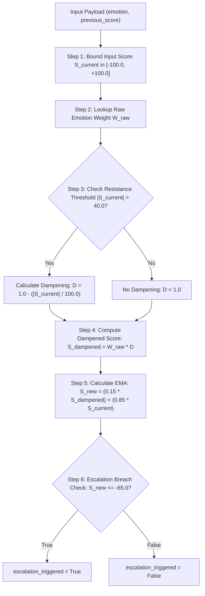

# Live Sentiment Score Calculation Logic & Microservice Specification (`score.md`)

This document provides a comprehensive technical specification of the live sentiment scoring algorithm implemented in `service-score/main.py`. It explains the mathematical formulas, non-linear dampening logic, contextual emotion severity hierarchy, escalation threshold detection, and provides detailed worked calculation examples.

---

## 1. Overview & Purpose

The **Live Sentiment Score Service** (`service-score`) calculates a real-time Exponential Moving Average (EMA) score $S \in [-100.0, +100.0]$ that tracks the overall emotional trajectory of a live call session.

### Key Architectural Concepts:
1. **Exponential Moving Average (EMA)**: Smooths out rapid fluctuations by giving high weight to historical state while dynamically absorbing new emotional signals ($\alpha = 0.15$).
2. **Contextual Emotion Severity Hierarchy**: Maps fine-grained emotions detected by RoBERTa to predefined severity weights ranging from $+100.0$ (gratitude) down to $-100.0$ (anger).
3. **Non-Linear Asymptotic Dampening**: When the session score magnitude $|S_{\text{current}}|$ exceeds a resistance threshold ($40.0$), a dynamic dampening multiplier reduces the impact of consecutive extreme sentiment spikes to prevent rapid saturation.
4. **Escalation Threshold Breach**: Triggers a manager intervention signal when the live score breaches critical negative territory ($S_{\text{new}} \le -65.0$).

---

## 2. API Data Contracts

### 2.1 Request Schema (`ScoreRequest`)
- **Endpoint**: `POST /calculate-score`
- **Content-Type**: `application/json`

```json
{
  "emotion": "anger",
  "confidence": 0.85,
  "previous_score": -35.0
}
```

| Field | Type | Required | Default | Description |
| :--- | :--- | :--- | :--- | :--- |
| `emotion` | `string` | Yes | `""` | The primary emotion string detected (e.g., `"anger"`, `"gratitude"`). |
| `confidence` | `float` | No | `0.0` | RoBERTa confidence score ($0.0 \le C \le 1.0$). |
| `previous_score` | `float` | No | `0.0` | The current session score ($S_{\text{current}}$) prior to processing this segment. |

---

### 2.2 Response Schema (`ScoreResponse`)

```json
{
  "emotion": "anger",
  "confidence": 0.85,
  "emotion_weight": -100.0,
  "previous_score": -35.0,
  "dampening_factor": 1.0,
  "dampened_raw_score": -100.0,
  "score": -44.75,
  "escalation_triggered": false
}
```

| Field | Type | Description |
| :--- | :--- | :--- |
| `emotion` | `string` | Echoed raw emotion input string. |
| `confidence` | `float` | Echoed confidence score. |
| `emotion_weight` | `float` | Predefined contextual severity weight ($W_{\text{raw}}$) for the emotion. |
| `previous_score` | `float` | Input score bounded to $[-100.0, +100.0]$ and rounded to 2 decimal places. |
| `dampening_factor` | `float` | Calculated asymptotic dampening multiplier $D \in (0.0, 1.0]$. |
| `dampened_raw_score` | `float` | Effective raw score after dampening ($S_{\text{dampened}} = W_{\text{raw}} \times D$). |
| `score` | `float` | The newly updated EMA live score ($S_{\text{new}}$). |
| `escalation_triggered` | `boolean` | `true` if $S_{\text{new}} \le -65.0$, otherwise `false`. |

---

## 3. Contextual Severity Emotion Weights (`EMOTION_WEIGHTS`)

Emotions are categorized into a hierarchical weight matrix ($+100.0$ for maximum positive satisfaction to $-100.0$ for maximum negative hostility):

### Positive Hierarchy ($+5.0$ to $+100.0$)
| Emotion | Weight ($W_{\text{raw}}$) | Emotion | Weight ($W_{\text{raw}}$) |
| :--- | :--- | :--- | :--- |
| `gratitude` | $+100.0$ | `excitement` | $+55.0$ |
| `relief` | $+95.0$ | `surprise` | $+45.0$ |
| `approval` | $+85.0$ | `amusement` | $+35.0$ |
| `optimism` | $+80.0$ | `curiosity` | $+25.0$ |
| `caring` | $+75.0$ | `pride` | $+15.0$ |
| `joy` | $+70.0$ | `love` | $+10.0$ |
| `admiration` | $+65.0$ | `desire` | $+5.0$ |

### Negative Hierarchy ($-15.0$ to $-100.0$)
| Emotion | Weight ($W_{\text{raw}}$) | Emotion | Weight ($W_{\text{raw}}$) |
| :--- | :--- | :--- | :--- |
| `anger` | $-100.0$ | `annoyance` | $-70.0$ |
| `disgust` | $-95.0$ | `fear` | $-65.0$ |
| `grief` | $-90.0$ | `remorse` | $-55.0$ |
| `sadness` | $-85.0$ | `nervousness` | $-45.0$ |
| `disappointment` | $-80.0$ | `embarrassment` | $-35.0$ |
| `disapproval` | $-75.0$ | `confusion` | $-25.0$ |
| | | `realization` | $-15.0$ |

### Neutral Baseline
| Emotion | Weight ($W_{\text{raw}}$) |
| :--- | :--- |
| `neutral` / unknown | $0.0$ |

---

## 4. Mathematical Step-by-Step Scoring Algorithm

The score computation follows a strict 6-step pipeline:



### Step 1: Input Score Bounding
To prevent corrupt state propagation, the previous session score is constrained within valid bounds:
$$S_{\text{current}} = \max\left(-100.0, \min\left(100.0, S_{\text{previous}}\right)\right)$$

### Step 2: Contextual Emotion Weight Lookup
$$W_{\text{raw}} = \text{EMOTION\_WEIGHTS}.\text{get}(\text{emotion.lower}(), 0.0)$$

### Step 3: Asymptotic Dampening Factor ($D$)
When the magnitude $|S_{\text{current}}|$ exceeds the resistance threshold $\text{RESISTANCE\_THRESHOLD} = 40.0$, non-linear dampening is activated:

$$D = \begin{cases} 1.0 - \frac{|S_{\text{current}}|}{100.0}, & \text{if } |S_{\text{current}}| > 40.0 \\[6pt] 1.0, & \text{if } |S_{\text{current}}| \le 40.0 \end{cases}$$

### Step 4: Dampened Raw Score ($S_{\text{dampened}}$)
$$S_{\text{dampened}} = W_{\text{raw}} \times D$$

### Step 5: Exponential Moving Average (EMA) Update
With smoothing parameter $\alpha = 0.15$:

$$S_{\text{new}} = (\alpha \times S_{\text{dampened}}) + ((1.0 - \alpha) \times S_{\text{current}})$$

$$S_{\text{new}} = \max\left(-100.0, \min\left(100.0, \operatorname{round}(S_{\text{new}}, 2)\right)\right)$$

### Step 6: Escalation Threshold Check
$$\text{escalation\_triggered} = (S_{\text{new}} \le -65.0)$$

---

## 5. Worked Calculation Examples

### Example 1: Call Start (Initial Neutral State)
- **Input**:
  - `emotion`: `"anger"` ($W_{\text{raw}} = -100.0$)
  - `previous_score`: `0.0`
- **Calculation Steps**:
  1. $S_{\text{current}} = 0.0$
  2. $W_{\text{raw}} = -100.0$
  3. $|S_{\text{current}}| = 0.0 \le 40.0 \longrightarrow D = 1.0$
  4. $S_{\text{dampened}} = -100.0 \times 1.0 = -100.0$
  5. $S_{\text{new}} = (0.15 \times -100.0) + (0.85 \times 0.0) = -15.0$
  6. $-15.0 \le -65.0 \longrightarrow \text{escalation\_triggered} = \text{false}$
- **Response Score**: `-15.0`

---

### Example 2: Consecutive Hostility (Non-Linear Dampening Active)
- **Input**:
  - `emotion`: `"disgust"` ($W_{\text{raw}} = -95.0$)
  - `previous_score`: `-50.0`
- **Calculation Steps**:
  1. $S_{\text{current}} = -50.0$
  2. $W_{\text{raw}} = -95.0$
  3. $|S_{\text{current}}| = 50.0 > 40.0 \longrightarrow D = 1.0 - \frac{50.0}{100.0} = 0.50$
  4. $S_{\text{dampened}} = -95.0 \times 0.50 = -47.50$
  5. $S_{\text{new}} = (0.15 \times -47.50) + (0.85 \times -50.0) = -7.125 + (-42.5) = -49.625 \approx -49.63$
  6. $-49.63 > -65.0 \longrightarrow \text{escalation\_triggered} = \text{false}$
- **Response Score**: `-49.63` ($D = 0.50$)

---

### Example 3: Critical Escalation Threshold Breach
- **Input**:
  - `emotion`: `"anger"` ($W_{\text{raw}} = -100.0$)
  - `previous_score`: `-62.0`
- **Calculation Steps**:
  1. $S_{\text{current}} = -62.0$
  2. $W_{\text{raw}} = -100.0$
  3. $|S_{\text{current}}| = 62.0 > 40.0 \longrightarrow D = 1.0 - \frac{62.0}{100.0} = 0.38$
  4. $S_{\text{dampened}} = -100.0 \times 0.38 = -38.0$
  5. $S_{\text{new}} = (0.15 \times -38.0) + (0.85 \times -62.0) = -5.7 + (-52.7) = -58.40$
- **Response Score**: `-58.40`

*If another severe negative message arrives with $S_{\text{current}} = -64.0$ and `emotion`: `"disgust"` ($W_{\text{raw}} = -95.0$)*:
  1. $D = 1.0 - 0.64 = 0.36$
  2. $S_{\text{dampened}} = -95.0 \times 0.36 = -34.20$
  3. $S_{\text{new}} = (0.15 \times -34.20) + (0.85 \times -65.0) = -5.13 + (-55.25) = -60.38$

---

### Example 4: Positive Recovery
- **Input**:
  - `emotion`: `"gratitude"` ($W_{\text{raw}} = +100.0$)
  - `previous_score`: `-30.0`
- **Calculation Steps**:
  1. $S_{\text{current}} = -30.0$
  2. $W_{\text{raw}} = +100.0$
  3. $|S_{\text{current}}| = 30.0 \le 40.0 \longrightarrow D = 1.0$
  4. $S_{\text{dampened}} = +100.0 \times 1.0 = +100.0$
  5. $S_{\text{new}} = (0.15 \times 100.0) + (0.85 \times -30.0) = 15.0 - 25.5 = -10.50$
  6. $-10.50 > -65.0 \longrightarrow \text{escalation\_triggered} = \text{false}$
- **Response Score**: `-10.50` (Score recovered upwards by +19.5 points in a single sentence).

---

## 6. Microservice Execution Commands

To run the score calculation service independently:

```bash
cd service-score
uvicorn main:app --host 0.0.0.0 --port 8004 --reload
```

Test endpoint via cURL:

```bash
curl -X POST "http://localhost:8004/calculate-score" \
     -H "Content-Type: application/json" \
     -d '{
           "emotion": "gratitude",
           "confidence": 0.95,
           "previous_score": 12.5
         }'
```
