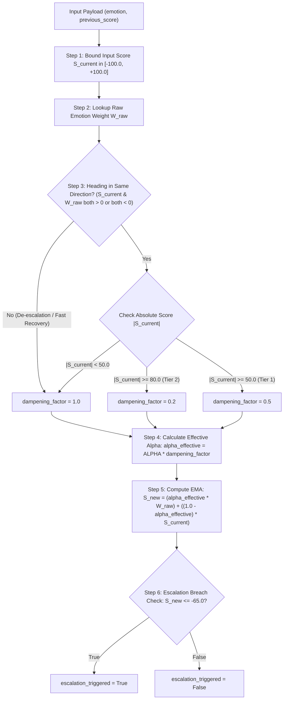

# Live Sentiment Score Calculation Logic & Microservice Specification (`score.md`)

This document provides a comprehensive technical specification of the live sentiment scoring algorithm implemented in `service-score/main.py`. It explains the mathematical formulas, dampening logic, directional awareness, contextual emotion severity hierarchy, escalation threshold detection, and detailed worked calculation examples.

---

## 1. Overview & Purpose

The **Live Sentiment Score Service** (`service-score`) calculates a real-time Exponential Moving Average (EMA) score $S \in [-100.0, +100.0]$ that tracks the overall emotional trajectory of a live call session.

### Key Architectural Concepts:
1. **Exponential Moving Average (EMA)**: Smooths out rapid fluctuations by maintaining historical state while dynamically absorbing new emotional signals ($\alpha = 0.3$).
2. **Contextual Emotion Severity Hierarchy**: Maps fine-grained emotions detected by RoBERTa to predefined severity weights ranging from $+100.0$ (gratitude) down to $-100.0$ (anger).
3. **Alpha Dampening (Fixing the Math Flaw)**: Dampening is applied to the smoothing factor $\alpha$ ($\alpha_{\text{effective}} = \alpha \times \text{dampening\_factor}$) rather than changing the target raw weight ($W_{\text{raw}}$). This slows down how fast the score moves without mathematical distortion at extreme scores.
4. **Directional Awareness (Fast Recovery)**: Dampening only applies when sentiment is compounding in the same direction. If a negative score caller expresses positive sentiment (e.g. gratitude), dampening is bypassed (`dampening_factor = 1.0`) so the agent's de-escalation recovers the score rapidly at full speed.
5. **Tiered Resistance (Two Thresholds)**:
   - **Tier 1 (50.0)**: If $|S_{\text{current}}| \ge 50.0$ and compounding in the same direction, speed is cut by half (`dampening_factor = 0.5`).
   - **Tier 2 (80.0)**: If $|S_{\text{current}}| \ge 80.0$ and compounding in the same direction, speed is cut drastically (`dampening_factor = 0.2`) to prevent saturation near absolute limits.
6. **Escalation Threshold Breach**: Triggers a manager intervention signal when the live score breaches critical negative territory ($S_{\text{new}} \le -65.0$).

---

## 2. API Data Contracts

### 2.1 Request Schema (`ScoreRequest`)
- **Endpoint**: `POST /calculate-score`
- **Content-Type**: `application/json`

```json
{
  "emotion": "disgust",
  "confidence": 0.85,
  "previous_score": -70.0
}
```

| Field | Type | Required | Default | Description |
| :--- | :--- | :--- | :--- | :--- |
| `emotion` | `string` | Yes | `""` | The primary emotion string detected (e.g., `"anger"`, `"gratitude"`). |
| `confidence` | `float` | No | `0.0` | RoBERTa confidence score ($0.0 \le C \le 1.0$). |
| `previous_score` | `float` | No | `0.0` | The current session score ($S_{\text{current}}$) prior to processing this segment. |

---

### 2.2 Response Schema (`ScoreResponse`)

```json
{
  "emotion": "disgust",
  "confidence": 0.85,
  "emotion_weight": -95.0,
  "previous_score": -70.0,
  "dampening_factor": 0.5,
  "dampened_raw_score": -47.5,
  "score": -73.75,
  "escalation_triggered": true
}
```

| Field | Type | Description |
| :--- | :--- | :--- |
| `emotion` | `string` | Echoed raw emotion input string. |
| `confidence` | `float` | Echoed confidence score. |
| `emotion_weight` | `float` | Predefined contextual severity weight ($W_{\text{raw}}$) for the emotion. |
| `previous_score` | `float` | Input score bounded to $[-100.0, +100.0]$ and rounded to 2 decimal places. |
| `dampening_factor` | `float` | Calculated dampening factor ($0.2$, $0.5$, or $1.0$). |
| `dampened_raw_score` | `float` | Contextual reference calculated as $W_{\text{raw}} \times \text{dampening\_factor}$. |
| `score` | `float` | The newly updated EMA live score ($S_{\text{new}}$). |
| `escalation_triggered` | `boolean` | `true` if $S_{\text{new}} \le -65.0$, otherwise `false`. |

---

## 3. Contextual Severity Emotion Weights (`EMOTION_WEIGHTS`)

Emotions are categorized into a hierarchical weight matrix ($+100.0$ for maximum positive satisfaction to $-100.0$ for maximum negative hostility):

### Positive Hierarchy ($+5.0$ to $+100.0$)
| Emotion | Weight ($W_{\text{raw}}$) | Emotion | Weight ($W_{\text{raw}}$) |
| :--- | :--- | :--- | :--- |
| `gratitude` | $+100.0$ | `excitement` | $+55.0$ |
| `relief` | $+95.0$ | `surprise` | $+45.0$ |
| `approval` | $+85.0$ | `amusement` | $+35.0$ |
| `optimism` | $+80.0$ | `curiosity` | $+25.0$ |
| `caring` | $+75.0$ | `pride` | $+15.0$ |
| `joy` | $+70.0$ | `love` | $+10.0$ |
| `admiration` | $+65.0$ | `desire` | $+5.0$ |

### Negative Hierarchy ($-15.0$ to $-100.0$)
| Emotion | Weight ($W_{\text{raw}}$) | Emotion | Weight ($W_{\text{raw}}$) |
| :--- | :--- | :--- | :--- |
| `anger` | $-100.0$ | `annoyance` | $-70.0$ |
| `disgust` | $-95.0$ | `fear` | $-65.0$ |
| `grief` | $-90.0$ | `remorse` | $-55.0$ |
| `sadness` | $-85.0$ | `nervousness` | $-45.0$ |
| `disappointment` | $-80.0$ | `embarrassment` | $-35.0$ |
| `disapproval` | $-75.0$ | `confusion` | $-25.0$ |
| | | `realization` | $-15.0$ |

### Neutral Baseline
| Emotion | Weight ($W_{\text{raw}}$) |
| :--- | :--- |
| `neutral` / unknown | $0.0$ |

---

## 4. Mathematical Step-by-Step Scoring Algorithm

The score computation follows a strict 6-step pipeline:



### Step 1: Input Score Bounding
To prevent corrupt state propagation, the previous session score is constrained within valid bounds:
$$S_{\text{current}} = \max\left(-100.0, \min\left(100.0, S_{\text{previous}}\right)\right)$$

### Step 2: Contextual Emotion Weight Lookup
$$W_{\text{raw}} = \text{EMOTION\_WEIGHTS}.\text{get}(\text{emotion.lower}(), 0.0)$$

### Step 3: Directional Check & Tiered Resistance Dampening ($D$)
Check if the current score and new emotion are compounding in the same direction:
$$\text{same\_direction} = (S_{\text{current}} > 0 \land W_{\text{raw}} > 0) \lor (S_{\text{current}} < 0 \land W_{\text{raw}} < 0)$$

Determine the dampening factor $D$:
$$D = \begin{cases} 
0.2, & \text{if } \text{same\_direction} \text{ and } |S_{\text{current}}| \ge 80.0 \text{ (Tier 2 Resistance)} \\
0.5, & \text{if } \text{same\_direction} \text{ and } |S_{\text{current}}| \ge 50.0 \text{ (Tier 1 Resistance)} \\
1.0, & \text{otherwise (Fast Recovery / Below Tier 1)}
\end{cases}$$

### Step 4: Effective Alpha Calculation
$$\alpha_{\text{effective}} = \alpha \times D \quad (\text{where base } \alpha = 0.3)$$

### Step 5: Exponential Moving Average (EMA) Update
$$S_{\text{new}} = (\alpha_{\text{effective}} \times W_{\text{raw}}) + ((1.0 - \alpha_{\text{effective}}) \times S_{\text{current}})$$

$$S_{\text{new}} = \max\left(-100.0, \min\left(100.0, \operatorname{round}(S_{\text{new}}, 2)\right)\right)$$

### Step 6: Escalation Threshold Check
$$\text{escalation\_triggered} = (S_{\text{new}} \le -65.0)$$

---

## 5. Worked Calculation Examples

Assuming base $\alpha = 0.3$:

### Example 1: Hitting Tier 1 Resistance (Slowing Down)
- **State**: The caller is already angry and utters another negative sentiment.
- **Input**:
  - $S_{\text{current}} = -70.0$
  - `emotion`: `"disgust"` ($W_{\text{raw}} = -95.0$)
- **Logic**: Directions match (both negative) and $|S_{\text{current}}| = 70.0 \ge 50.0$ (Tier 1 threshold).
- **Calculation Steps**:
  1. $\text{dampening\_factor} = 0.5$
  2. $\alpha_{\text{effective}} = 0.3 \times 0.5 = 0.15$
  3. $S_{\text{new}} = (0.15 \times -95.0) + (0.85 \times -70.0) = -14.25 + (-59.50) = -73.75$
  4. $-73.75 \le -65.0 \longrightarrow \text{escalation\_triggered} = \text{true}$
- **Result**: `-73.75` (The score moves from -70 to -73.75, preventing premature over-escalation).

---

### Example 2: Fast Recovery (De-escalation)
- **State**: The caller is very angry, but the agent offers a solution and the caller expresses gratitude.
- **Input**:
  - $S_{\text{current}} = -70.0$
  - `emotion`: `"gratitude"` ($W_{\text{raw}} = +100.0$)
- **Logic**: Directions are opposite (Current is negative, New is positive). Dampening is bypassed!
- **Calculation Steps**:
  1. $\text{dampening\_factor} = 1.0$ (Full speed)
  2. $\alpha_{\text{effective}} = 0.3 \times 1.0 = 0.30$
  3. $S_{\text{new}} = (0.30 \times 100.0) + (0.70 \times -70.0) = 30.0 - 49.0 = -19.00$
  4. $-19.00 > -65.0 \longrightarrow \text{escalation\_triggered} = \text{false}$
- **Result**: `-19.00` (The score rapidly recovers from -70.0 all the way to -19.00, reflecting immediate de-escalation).

---

### Example 3: Hitting Tier 2 Resistance (Extreme Friction)
- **State**: Caller is extremely hostile over a sustained duration.
- **Input**:
  - $S_{\text{current}} = -85.0$
  - `emotion`: `"anger"` ($W_{\text{raw}} = -100.0$)
- **Logic**: Directions match and $|S_{\text{current}}| = 85.0 \ge 80.0$ (Tier 2 threshold).
- **Calculation Steps**:
  1. $\text{dampening\_factor} = 0.2$ (80% speed reduction)
  2. $\alpha_{\text{effective}} = 0.3 \times 0.2 = 0.06$
  3. $S_{\text{new}} = (0.06 \times -100.0) + (0.94 \times -85.0) = -6.00 + (-79.90) = -85.90$
  4. $-85.90 \le -65.0 \longrightarrow \text{escalation\_triggered} = \text{true}$
- **Result**: `-85.90` (The score barely moves from -85.0 to -85.90, preventing absolute floor saturation).

---

### Example 4: Initial Segment / Standard Speed Below Tier 1
- **State**: Starting session from zero state.
- **Input**:
  - $S_{\text{current}} = 0.0$
  - `emotion`: `"anger"` ($W_{\text{raw}} = -100.0$)
- **Logic**: $|S_{\text{current}}| = 0.0 < 50.0 \longrightarrow \text{dampening\_factor} = 1.0$.
- **Calculation Steps**:
  1. $\alpha_{\text{effective}} = 0.3 \times 1.0 = 0.30$
  2. $S_{\text{new}} = (0.30 \times -100.0) + (0.70 \times 0.0) = -30.00$
  3. $-30.00 > -65.0 \longrightarrow \text{escalation\_triggered} = \text{false}$
- **Result**: `-30.00`

---

## 6. Microservice Execution Commands

To run the score calculation service independently:

```bash
cd service-score
uvicorn main:app --host 0.0.0.0 --port 8004 --reload
```

Test endpoint via cURL:

```bash
curl -X POST "http://localhost:8004/calculate-score" \
     -H "Content-Type: application/json" \
     -d '{
           "emotion": "gratitude",
           "confidence": 0.95,
           "previous_score": -70.0
         }'
```
